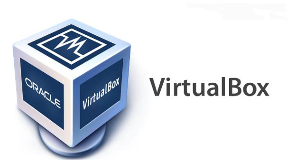

# Experiment 1: Installation of Virtualization Software

## Aim

To install virtualization software and create virtual machines
with different flavours of Linux or Windows operating systems.

---

## Introduction

Virtualization is a technology that allows a physical computer
(host machine) to run one or more virtual computers (virtual
machines) simultaneously.

A virtualization platform provides the required virtual hardware,
such as:

- Virtual CPU
- Virtual RAM
- Virtual storage
- Virtual network adapter
- Virtual display
- Virtual input devices

An operating system running inside a virtual machine is called the
**guest operating system**, while the physical operating system on
which the virtualization software runs is called the **host
operating system**.

Common desktop virtualization platforms include:

- Oracle VM VirtualBox
- VMware Workstation
- Microsoft Hyper-V

---

# Part A — Procedure from the Laboratory Manual

> **Note:** The original laboratory manual was written for an older
> Windows environment and uses Oracle VM VirtualBox 5.0.20 in its
> screenshots. The procedure below preserves the procedure provided
> in the laboratory manual for reference.

## Software Used in the Original Manual

- Oracle VM VirtualBox
- Windows 7 / Windows 8 as the host operating system
- Linux or Windows as the guest operating system

---

## Step 1: Download and Start VirtualBox Installer

Download the VirtualBox installer and launch the executable file.

The VirtualBox Setup Wizard appears.

Click **Next** to continue with the installation.


---

## Step 2: Select Installation Components

The **Custom Setup** window displays the VirtualBox components
and features that can be installed.

Review the selected components and installation directory.

Click **Next** to continue.


---

## Step 3: Configure Installation Options

The installer displays additional installation options.

The available options in the manual include:

- Create a shortcut on the desktop
- Create a shortcut in the Quick Launch Bar
- Register file associations

Select the required options and click **Next**.


---

## Step 4: Confirm Network Interface Installation

VirtualBox needs to install virtual networking components to allow
virtual machines to communicate with the host system and external
networks.

The installer displays a warning that the network connection may
be temporarily interrupted during installation.

Click **Yes** to continue.


---

## Step 5: Start the Installation

The **Ready to Install** screen is displayed.

Review the installation configuration and click **Install**.


---

## Step 6: Complete the Installation

After the installation process completes, VirtualBox is installed
on the host operating system.

The VirtualBox application can then be launched to create and
manage virtual machines.



---

## Result of Part A

The procedure for installing Oracle VM VirtualBox on a Windows host
system was studied, including the configuration of installation
components, installation options, networking components, and
completion of the installation.

---

# Part B — Modern Implementation

## Objective

The original experiment can be implemented on a modern Windows
system using a current desktop virtualization platform.

For the modern implementation, **VMware Workstation Pro** can be
used to create and run a Linux or Windows virtual machine.

> **Modernization note:** This section is an updated implementation
> of the same virtualization concept. It is not intended to replace
> the procedure given in Part A of the laboratory manual.

---

## Modern Software Stack

| Component | Modern Implementation |
|---|---|
| Host OS | Windows 10 / Windows 11 |
| Virtualization Platform | VMware Workstation Pro |
| Guest OS | Linux or Windows |
| Virtual Disk | VMDK |
| Virtual Network | NAT / Bridged |
| Virtual Hardware | Virtual CPU, RAM, storage and network adapter |

VMware Workstation Pro is VMware's desktop virtualization platform
for running virtual machines on Windows and Linux hosts.

Current VMware Workstation releases are distributed through the
Broadcom Support Portal. The current 2026 release documentation
lists VMware Workstation 26H1.

Official resources:

- [VMware Workstation Pro downloads](https://support.broadcom.com/group/ecx/productdownloads?subfamily=VMware%20Workstation%20Pro&freeDownloads=true)
- [VMware Workstation documentation](https://techdocs.broadcom.com/us/en/vmware-cis/desktop-hypervisors/workstation-pro/26H1.html)

---

## Step 1: Download VMware Workstation Pro

1. Open the official Broadcom Support Portal.
2. Navigate to the VMware Workstation Pro downloads.
3. Download the Windows installer for the current supported release.
4. Run the installer as an administrator if required.

The installer guides the user through the required installation
steps.

---

## Step 2: Install VMware Workstation Pro

Follow the installation wizard.

Typical installation stages include:

1. Accepting the license agreement.
2. Selecting the installation location.
3. Configuring user experience and update preferences.
4. Selecting shortcuts if required.
5. Completing the installation.

After installation, launch **VMware Workstation Pro**.

---

## Step 3: Obtain a Guest Operating System

To create a virtual machine, an operating system installation image
is required.

For example:

- Ubuntu Linux ISO
- Fedora Linux ISO
- Debian Linux ISO
- Windows ISO

The ISO file acts as the virtual installation media for the guest
operating system.

---

## Step 4: Create a New Virtual Machine

Open VMware Workstation Pro and select:

**Create a New Virtual Machine**

Choose:

**Typical (recommended)**

The wizard asks for the installation media.

Select:

**Installer disc image file (ISO)**

and browse to the downloaded operating-system ISO.

---

## Step 5: Configure the Virtual Machine

Configure the virtual hardware according to the requirements of
the guest operating system.

Typical resources include:

### Processor

Assign one or more virtual CPU cores.

### Memory

Assign an appropriate amount of RAM.

For example:

```text
RAM: 4 GB