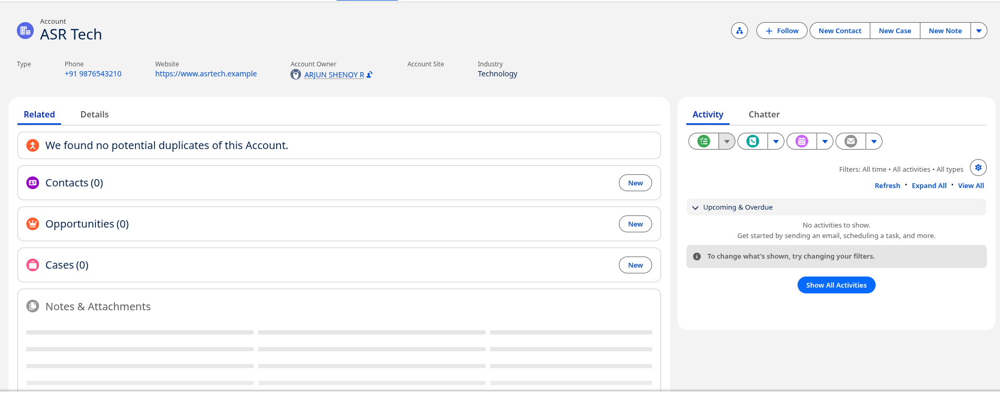

# Experiment 4: Develop a Simple Application Using Apex Programming Language of Salesforce.com

## Aim

To develop a simple custom application using the Apex programming language on the Salesforce cloud platform.

---

## Objectives

- To understand the basics of Apex programming.
- To create an Apex class in Salesforce.
- To define a simple Apex method.
- To execute Apex code using the Developer Console.
- To view program output in the Salesforce debug log.

---

# Part A — Procedure from the Laboratory Manual

> **Note:** This section follows the procedure given in the SCEM Cloud Computing and Security laboratory manual. The manual uses the Salesforce Developer Console and a simple `HelloWorldApp` Apex class.

## Software / Platform Used

- Salesforce Developer Org
- Salesforce Developer Console
- Apex programming language

---

## Step 1: Sign up for a Salesforce Developer Org

If a Salesforce Developer Org is not already available:

1. Open the Salesforce Developer signup page.
2. Create a free developer account.
3. Complete the registration process.
4. Verify the account if required.
5. Log in to the Salesforce Developer Org.

The laboratory manual specifies using a free Salesforce Developer account for this experiment.

---

## Step 2: Log in to the Developer Org

Log in to the Salesforce Developer Org using the registered credentials.

After successful login, the Salesforce interface is displayed.

---

## Step 3: Open the Developer Console

Open the **Developer Console**.

According to the laboratory manual:

1. Click the **Setup / gear** icon.
2. In Salesforce Classic, the gear/setup option is available in the top-right area.
3. In Lightning Experience, use the setup menu.
4. Select **Developer Console**.

The Developer Console provides tools for writing, executing, and debugging Apex code.

---

## Step 4: Create a New Apex Class

In the Developer Console:

1. Select:

```text
File → New → Apex Class
```

2. Enter the class name:

```text
HelloWorldApp
```

3. Click **OK**.

Salesforce generates the basic class structure.

---

## Step 5: Write the Apex Code

Replace or modify the generated class with the following Apex code:

```apex
public class HelloWorldApp {
    public static void sayHello() {
        System.debug('WELCOME TO APEX PROGRAMMING');
    }
}
```

The class contains a static method named `sayHello()`.

The `System.debug()` statement writes the message to the Salesforce debug log.

Save the class using:

```text
File → Save
```

---

## Step 6: Execute the Apex Code

To execute the method:

1. In the Developer Console, open:

```text
Debug → Open Execute Anonymous Window
```

2. Enter:

```apex
HelloWorldApp.sayHello();
```

3. Ensure that **Open Log** is selected.
4. Click **Execute**.

Salesforce executes the Apex method and creates an execution log.

---

## Step 7: View the Output

The execution log opens after the code is executed.

Enable the **Debug Only** option in the log inspector to display only debug output.

The following message should be displayed:

```text
WELCOME TO APEX PROGRAMMING
```

This confirms that the Apex class and method were executed successfully.

---

## Result — Part A

A simple Salesforce application was developed using the Apex programming language.

An Apex class named `HelloWorldApp` was created, a method was defined, and the method was executed using the Salesforce Developer Console. The output was displayed in the debug log.

---

# Part B — Modern Implementation

The original laboratory manual uses the Salesforce Developer Console workflow. The same basic Apex experiment can be performed using a current Salesforce Developer environment.

The fundamental workflow remains:

```text
Salesforce Developer Org
        ↓
Developer Console / Developer Tools
        ↓
Create Apex Class
        ↓
Write Apex Code
        ↓
Save
        ↓
Execute Anonymous Apex
        ↓
View Debug Log
```

No screenshots are included in Part B.

---

## Step 1: Create / Access a Salesforce Developer Environment

Use a Salesforce Developer environment suitable for Apex development.

After logging in, open the Salesforce application and access the development tools.

---

## Step 2: Open Developer Tools

Open the Salesforce Developer Console from the setup interface.

The Developer Console provides access to:

- Apex classes
- Execute Anonymous
- Debug logs
- Query tools
- Other developer utilities

---

## Step 3: Create the Apex Class

Create a new Apex class named:

```text
HelloWorldApp
```

Use:

```text
File → New → Apex Class
```

Enter the class name and create the class.

---

## Step 4: Add the Apex Code

Use the following code:

```apex
public class HelloWorldApp {
    public static void sayHello() {
        System.debug('WELCOME TO APEX PROGRAMMING');
    }
}
```

Save the class.

---

## Step 5: Execute Anonymous Apex

Open:

```text
Debug → Open Execute Anonymous Window
```

Run:

```apex
HelloWorldApp.sayHello();
```

Enable the option to open the execution log and execute the code.

---

## Step 6: Inspect the Debug Log

Open the generated execution log.

Filter the log to show debug output.

The expected message is:

```text
WELCOME TO APEX PROGRAMMING
```

---

# Understanding the Apex Program

## Apex Class

The following statement defines an Apex class:

```apex
public class HelloWorldApp {
```

`HelloWorldApp` is the name of the class.

---

## Static Method

The following method is defined inside the class:

```apex
public static void sayHello() {
```

The method:

- Is `public`, so it can be accessed from other Apex code.
- Is `static`, so it can be called using the class name.
- Returns `void`, meaning it does not return a value.
- Is named `sayHello`.

---

## Debug Statement

The following statement writes a message to the Salesforce debug log:

```apex
System.debug('WELCOME TO APEX PROGRAMMING');
```

---

## Calling the Method

The method is invoked using:

```apex
HelloWorldApp.sayHello();
```

Because the method is static, it can be called directly using the class name without creating an object.

---

# Important Apex Concepts

| Concept           | Description                                                                             |
| ----------------- | --------------------------------------------------------------------------------------- |
| Apex              | Salesforce's programming language                                                       |
| Class             | Defines the structure and behavior of an Apex component                                 |
| Method            | A block of code that performs an operation                                              |
| `public`          | Allows the class or method to be accessed according to Salesforce Apex visibility rules |
| `static`          | Allows a method to be called without creating an object                                 |
| `void`            | Indicates that a method does not return a value                                         |
| `System.debug()`  | Writes debugging information to the execution log                                       |
| Execute Anonymous | Allows Apex code to be executed without creating a permanent Apex class for that code   |

---

# Expected Output

After executing:

```apex
HelloWorldApp.sayHello();
```

the debug log should contain:

```text
WELCOME TO APEX PROGRAMMING
```

---

# Result

The Apex application was successfully created and executed on the Salesforce cloud platform.

The `HelloWorldApp` class was created using Apex, the `sayHello()` method was executed using Execute Anonymous, and the output was verified using the Salesforce debug log.

---

# Conclusion

This experiment demonstrates the basic development workflow for Apex applications on Salesforce.

The experiment introduces Apex classes, methods, static methods, debug statements, Execute Anonymous, and debug logs. These concepts form the foundation for developing applications on the Salesforce cloud platform.

---

# Reference

- CS722I1C: Cloud Computing and Security Laboratory Manual, Department of Computer Science & Engineering, Sahyadri College of Engineering & Management, Mangaluru.

---

# Extended Implementation — ASR Tech Account Management

## Overview

As an extension to the basic application described in the laboratory manual, a practical Salesforce Account management application was implemented using Apex.

The application uses a Salesforce `Account` record named **ASR Tech** and demonstrates the basic CRUD operations:

- **Create** — Create the ASR Tech Account.
- **Read** — Retrieve the Account using SOQL.
- **Update** — Modify Account information using Apex DML.
- **Delete** — Delete the Account after completing the experiment.

This implementation provides a more practical demonstration of Apex programming than the basic HelloWorld example in the laboratory manual.

---

## Application Structure

```text
ASRTechAccountManager
        |
        +---- CREATE → insert Account
        |
        +---- READ   → SOQL query
        |
        +---- UPDATE → update Account
        |
        +---- DELETE → delete Account
```

---

## Apex Class

The Apex class used for the extended implementation is:

```text
ASRTechAccountManager
```

### `ASRTechAccountManager.cls`

```apex
public class ASRTechAccountManager {

    // CREATE
    public static Id createASRTech() {
        Account asrTech = new Account(
            Name = 'ASR Tech',
            Industry = 'Technology',
            Phone = '+91 9876543210',
            Website = 'https://www.asrtech.example',
            BillingCity = 'Mangaluru',
            BillingCountry = 'India',
            Description = 'Technology company created for Apex laboratory experiment.'
        );

        insert asrTech;

        System.debug('ASR Tech Account Created');
        System.debug('Account ID: ' + asrTech.Id);

        return asrTech.Id;
    }

    // READ
    public static Account getASRTech(Id accountId) {
        Account asrTech = [
            SELECT Id, Name, Industry, Phone, Website,
                   BillingCity, BillingCountry, Description
            FROM Account
            WHERE Id = :accountId
            LIMIT 1
        ];

        System.debug('ASR Tech Account Details:');
        System.debug(asrTech);

        return asrTech;
    }

    // UPDATE
    public static void updateASRTech(Id accountId) {
        Account asrTech = [
            SELECT Id, Name, Industry, Phone, Description
            FROM Account
            WHERE Id = :accountId
            LIMIT 1
        ];

        asrTech.Phone = '+91 8765432109';
        asrTech.Industry = 'Software Technology';
        asrTech.Description =
            'ASR Tech account updated using Apex DML operations.';

        update asrTech;

        System.debug('ASR Tech Account Updated');
    }

    // DELETE
    public static void deleteASRTech(Id accountId) {
        Account asrTech = [
            SELECT Id, Name
            FROM Account
            WHERE Id = :accountId
            LIMIT 1
        ];

        delete asrTech;

        System.debug('ASR Tech Account Deleted');
    }
}
```

---

## Create Operation

The Account is created using the Apex `insert` DML operation.

Run the following in **Execute Anonymous**:

```apex
Id accountId = ASRTechAccountManager.createASRTech();
System.debug('Created Account ID: ' + accountId);
```

The created Account contains:

| Field | Value |
|---|---|
| Account Name | ASR Tech |
| Industry | Technology |
| Phone | +91 9876543210 |
| Website | https://www.asrtech.example |
| Billing City | Mangaluru |
| Billing Country | India |

The method returns the Salesforce Account ID, which is used for the subsequent Read and Update operations.

---

## Create Operation — Output

The created record was verified in Salesforce under **Accounts**.



The Salesforce Account page confirms that **ASR Tech** was successfully created with the configured account information.

---

## Read Operation

The Account is retrieved using the `getASRTech()` method.

Run:

```apex
ASRTechAccountManager.getASRTech('YOUR_ACCOUNT_ID');
```

Replace `YOUR_ACCOUNT_ID` with the actual Salesforce Account ID returned by the Create operation.

The method uses SOQL:

```apex
SELECT Id, Name, Industry, Phone, Website,
       BillingCity, BillingCountry, Description
FROM Account
WHERE Id = :accountId
LIMIT 1
```

The retrieved Account is displayed in the Salesforce debug log.

### Read Verification

The Read operation was successfully executed using the Account ID generated during creation. The debug log displayed the retrieved `ASR Tech` Account details.

---

## Update Operation

The Account can be modified using:

```apex
ASRTechAccountManager.updateASRTech('YOUR_ACCOUNT_ID');
```

The method updates the phone number, industry, and description:

```text
Phone:
+91 9876543210
        ↓
+91 8765432109

Industry:
Technology
        ↓
Software Technology
```

The changes are committed using:

```apex
update asrTech;
```

After the update, the record can be verified again using:

```apex
ASRTechAccountManager.getASRTech('YOUR_ACCOUNT_ID');
```

---

## Delete Operation

The Account can be deleted using:

```apex
ASRTechAccountManager.deleteASRTech('YOUR_ACCOUNT_ID');
```

This operation should be performed **only after all required screenshots and verification have been completed**, because it permanently removes the Account from the Salesforce environment.

---

# Apex Concepts Demonstrated

| Concept | Implementation |
|---|---|
| Salesforce Object | `Account` |
| Object Creation | `new Account(...)` |
| Create / Insert | `insert asrTech` |
| Read | SOQL `SELECT` query |
| Update | `update asrTech` |
| Delete | `delete asrTech` |
| Debugging | `System.debug()` |
| Execute Anonymous | Used to invoke the Apex methods |

---

# Extended Implementation Result

The **ASR Tech** Salesforce Account was successfully created using Apex.

The record was retrieved using SOQL, demonstrating the Read operation. The implementation also provides Update and Delete operations using Apex DML.

Thus, the extended implementation demonstrates practical Apex programming using a real Salesforce `Account` object and basic CRUD operations.

---

# Extended Implementation Conclusion

The extended ASR Tech implementation builds upon the basic Apex concepts introduced in the laboratory manual.

Instead of only displaying a debug message, the application interacts with Salesforce data using:

- Apex classes and methods
- Salesforce `Account` objects
- SOQL
- DML operations
- Execute Anonymous
- Debug logs

This provides a practical demonstration of how Apex can be used to manipulate Salesforce data.

---

## Repository Files

The recommended Experiment 4 structure is:

```text
Experiment_4_Salesforce_Apex/
├── README.md
├── src/
│   └── ASRTechAccountManager.cls
└── images/
    ├── 01-manual-salesforce-apex.png
    ├── 09-asr-tech-account.png
    └── 10-asr-tech-read-output.png
```
