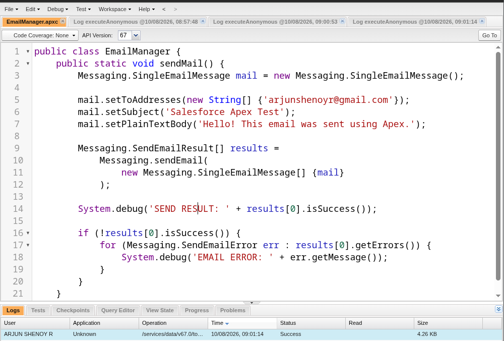
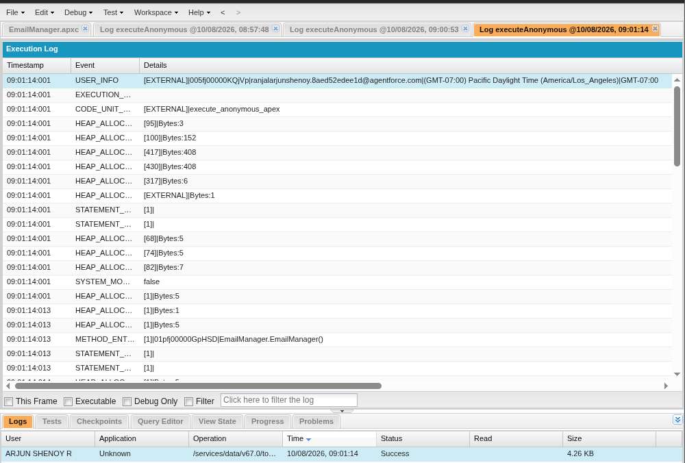
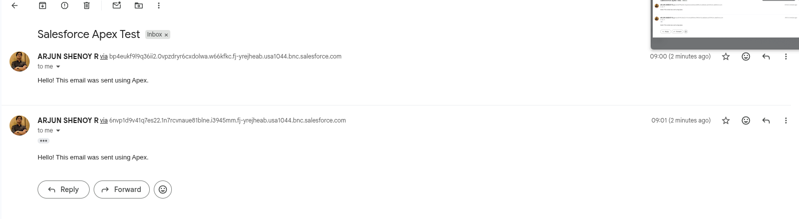

# Experiment 5: Implement a Mailing Service Using Apex Programming Language of Salesforce.com

## Aim

To implement a mailing service using the Apex programming language of Salesforce.com.

---

## Objectives

- To understand email handling in Salesforce using Apex.
- To create an Apex class for sending emails.
- To use the `Messaging.SingleEmailMessage` class.
- To send an email using `Messaging.sendEmail()`.
- To inspect the result of an email-sending operation.
- To execute Apex code using the Salesforce Developer Console.
- To verify successful email delivery.

---

## Platform / Software Used

- Salesforce Developer Org
- Salesforce Developer Console
- Apex programming language
- Gmail / Email client for verifying the received message

---

# Part A — Procedure from the Laboratory Manual

> **Note:** This section follows the procedure provided in the SCEM Cloud Computing and Security laboratory manual for Experiment 5. The manual uses an `EmailManager` Apex class with a parameterized `sendMail()` method and a helper method to inspect the email-sending results.

## Step 1: Open the Developer Console

Log in to the Salesforce Developer Org.

Open the **Developer Console** using the Salesforce setup / quick access menu.

The Developer Console is used to create, edit, execute, and debug Apex programs.

## Step 2: Create a New Apex Class

In the Developer Console, select:

```text
File → New → Apex Class
```

Enter the class name:

```text
EmailManager
```

Click **OK**.

## Step 3: Replace the Default Class Body

The laboratory manual provides an `EmailManager` class containing a public `sendMail()` method. The method accepts an email address, subject, and body, creates a `Messaging.SingleEmailMessage`, sends it using `Messaging.sendEmail()`, and inspects the returned result.

### Manual Implementation

```apex
public class EmailManager {

    public void sendMail(String address, String subject, String body) {

        Messaging.SingleEmailMessage mail =
            new Messaging.SingleEmailMessage();

        String[] toAddresses = new String[] {address};

        mail.setToAddresses(toAddresses);
        mail.setSubject(subject);
        mail.setPlainTextBody(body);

        Messaging.SendEmailResult[] results =
            Messaging.sendEmail(
                new Messaging.SingleEmailMessage[] { mail }
            );

        inspectResults(results);
    }

    private static Boolean inspectResults(
        Messaging.SendEmailResult[] results
    ) {
        Boolean sendResult = true;

        for (Messaging.SendEmailResult res : results) {

            if (res.isSuccess()) {
                System.debug('Email sent successfully');
            }
            else {
                sendResult = false;

                System.debug(
                    'The following errors occurred: ' +
                    res.getErrors()
                );
            }
        }

        return sendResult;
    }
}
```

## Step 4: Save the Class

Save the class using:

```text
File → Save
```

## Step 5: Test the Mailing Service

Open:

```text
Debug → Open Execute Anonymous Window
```

Example:

```apex
EmailManager em = new EmailManager();

em.sendMail(
    'YOUR_EMAIL_ADDRESS',
    'Email Subject',
    'Email Body'
);
```

Replace `YOUR_EMAIL_ADDRESS` with the recipient's email address and click **Execute**.

The manual also describes a static version that can be called directly using the class name.

---

# Part B — Modern Implementation

For the actual laboratory demonstration, a simpler static implementation was used. It sends a fixed test message and explicitly checks the `Messaging.SendEmailResult`.

The actual source file is:

```text
src/EmailManager.apxc
```

## Modern `EmailManager` Class

```apex
public class EmailManager {
    public static void sendMail() {
        Messaging.SingleEmailMessage mail =
            new Messaging.SingleEmailMessage();

        mail.setToAddresses(
            new String[] {'YOUR_EMAIL_ADDRESS'}
        );

        mail.setSubject('Salesforce Apex Test');

        mail.setPlainTextBody(
            'Hello! This email was sent using Apex.'
        );

        Messaging.SendEmailResult[] results =
            Messaging.sendEmail(
                new Messaging.SingleEmailMessage[] {mail}
            );

        System.debug(
            'SEND RESULT: ' +
            results[0].isSuccess()
        );

        if (!results[0].isSuccess()) {

            for (
                Messaging.SendEmailError err :
                results[0].getErrors()
            ) {
                System.debug(
                    'EMAIL ERROR: ' +
                    err.getMessage()
                );
            }
        }
    }
}
```

> Replace `YOUR_EMAIL_ADDRESS` with the email address to which the test email should be sent.

---

# Step 1: Configure Email Deliverability

Navigate to:

```text
Setup → Quick Find → Deliverability
```

Under **Access to Send Email (All Email Services)**, set:

```text
Access Level: All email
```

Click **Save**.

---

# Step 2: Save the `EmailManager` Class

After entering the Apex implementation, save the class:

```text
File → Save
```

---

# Step 3: Open Execute Anonymous

In the Developer Console, select:

```text
Debug → Open Execute Anonymous Window
```

Enter:

```apex
EmailManager.sendMail();
```

Make sure **Open Log** is selected.

---

# Step 4: Execute the Apex Code

Click **Execute**.

Salesforce executes the Apex transaction and generates an execution log.

---

# Step 5: Check the Execution Result

The modern implementation checks:

```apex
results[0].isSuccess()
```

A successful execution produces:

```text
SEND RESULT: true
```

If the operation fails, the implementation displays the corresponding error using:

```apex
System.debug('EMAIL ERROR: ' + err.getMessage());
```

---

# Step 6: Verify the Email

Open the recipient's email account.

The test email should contain:

```text
Subject: Salesforce Apex Test
```

and:

```text
Hello! This email was sent using Apex.
```

---

# Practical Execution Evidence

## 1. EmailManager Apex Class



Shows the `EmailManager` Apex class in the Salesforce Developer Console.

## 2. Salesforce Execution Log



Shows the execution log generated after running:

```apex
EmailManager.sendMail();
```

## 3. Received Email



Shows the successfully received Salesforce Apex test email.

---

# Working Principle

```text
Salesforce Developer Org
        │
        ▼
Developer Console
        │
        ▼
Create EmailManager Class
        │
        ▼
Create SingleEmailMessage
        │
        ├── Set Recipient
        ├── Set Subject
        └── Set Email Body
        │
        ▼
Messaging.sendEmail()
        │
        ▼
SendEmailResult
        │
        ├── Success → Email Delivered
        │
        └── Failure → Display Error
```

---

# Important Apex Components

| Component | Purpose |
|---|---|
| `EmailManager` | Apex class responsible for the mailing operation |
| `sendMail()` | Method used to create and send the email |
| `Messaging.SingleEmailMessage` | Represents a single email message |
| `setToAddresses()` | Specifies the recipient |
| `setSubject()` | Sets the email subject |
| `setPlainTextBody()` | Sets the plain-text email body |
| `Messaging.sendEmail()` | Sends the email through Salesforce |
| `Messaging.SendEmailResult` | Contains the result of the send operation |
| `isSuccess()` | Checks whether the email operation succeeded |
| `getErrors()` | Retrieves errors when the send operation fails |
| `System.debug()` | Displays information in the Salesforce debug log |

---

# Manual vs Modern Implementation

| Feature | Laboratory Manual | Modern Implementation |
|---|---|---|
| Class | `EmailManager` | `EmailManager` |
| Method | `sendMail(String, String, String)` | `sendMail()` |
| Method Type | Instance method | Static method |
| Recipient | Passed as parameter | Defined in the implementation |
| Subject | Passed as parameter | Defined in the implementation |
| Body | Passed as parameter | Defined in the implementation |
| Email API | `Messaging.SingleEmailMessage` | `Messaging.SingleEmailMessage` |
| Sending API | `Messaging.sendEmail()` | `Messaging.sendEmail()` |
| Result Handling | `inspectResults()` helper | Direct result checking |
| Execution | Execute Anonymous | Execute Anonymous |
| Verification | Recipient mailbox | Debug log and recipient mailbox |

---

# Repository Structure

```text
Experiment_5_Salesforce_Mailing_Service/
├── README.md
├── src/
│   └── EmailManager.apxc
└── images/
    ├── 01-emailmanager-code.png
    ├── 02-execution-log.png
    └── 03-email-received.png
```

The manual implementation and Execute Anonymous command are documented directly in this README. Only the actual `EmailManager` Apex class is maintained as a source file.

---

# Result

Thus, a mailing service was successfully implemented using the Apex programming language on the Salesforce cloud platform.

The `EmailManager` class successfully created and sent an email using Salesforce's `Messaging` API. The execution was verified through the Salesforce debug log and the email was successfully received in Gmail.

---

# Conclusion

This experiment demonstrates how Salesforce Apex can be used to implement an outbound mailing service.

The experiment covers the creation of an Apex class, configuration of a `SingleEmailMessage`, use of `Messaging.sendEmail()`, handling of the returned send result, execution through Execute Anonymous, and verification of the delivered email.
