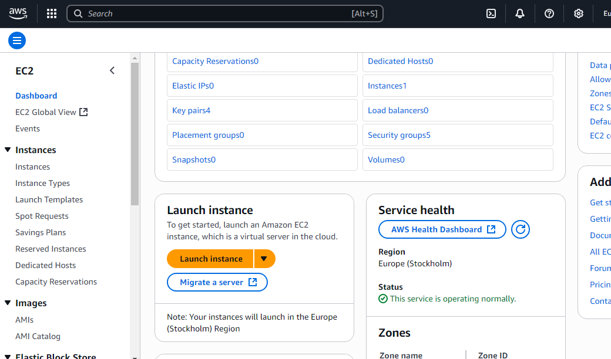
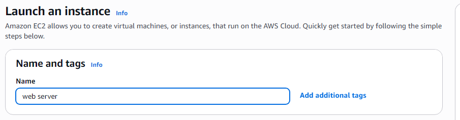
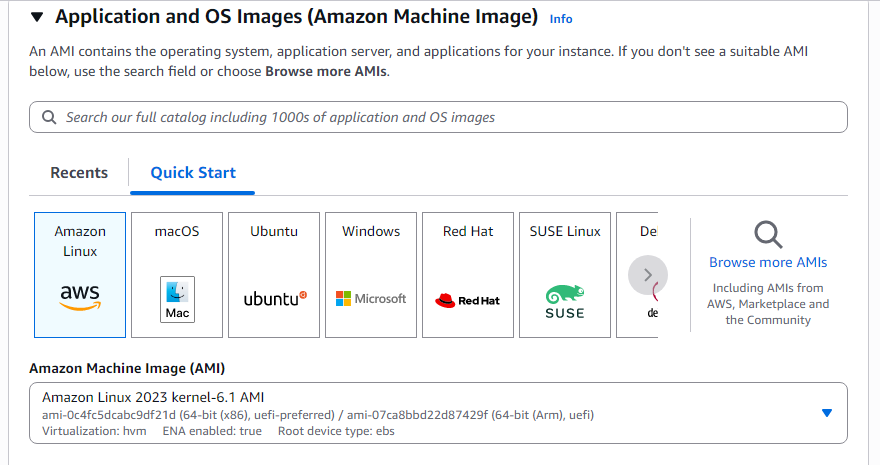
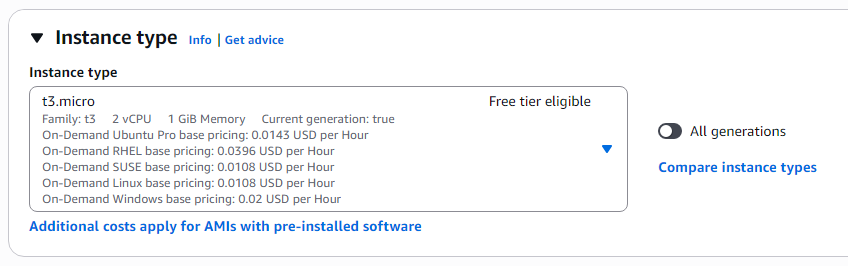
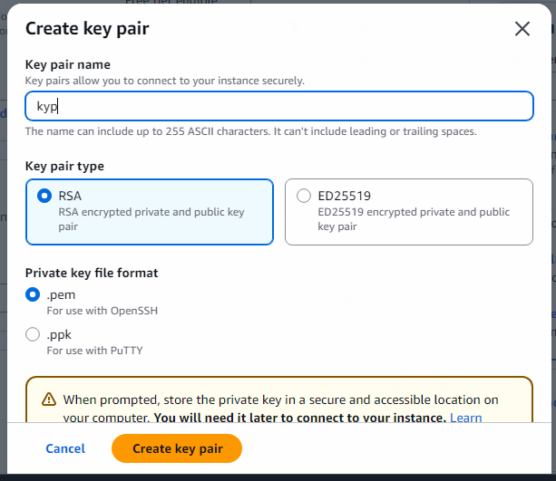
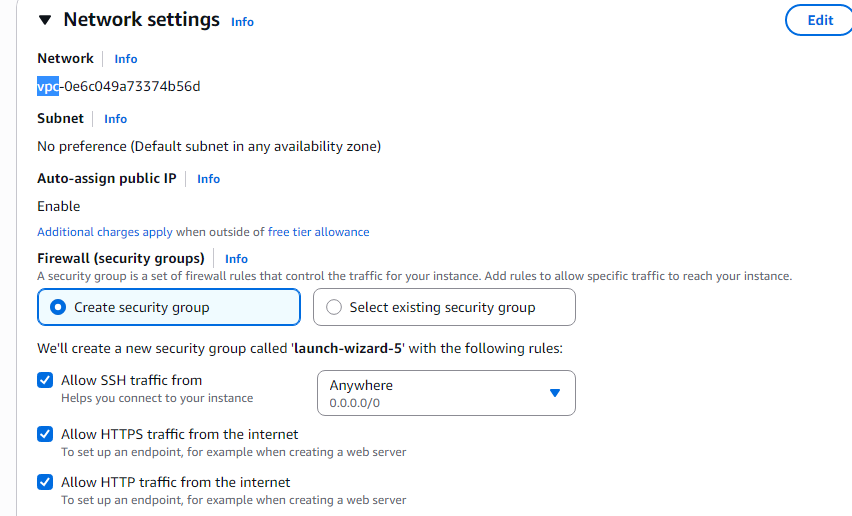

# Experiment 8: Deploy Dynamic Web Application on EC2 Instance on AWS

## Aim

To deploy a dynamic web application on an EC2 instance on AWS.

---

## Objectives

- To understand the basic workflow of deploying a web application on Amazon EC2.
- To launch and configure an EC2 instance.
- To select an appropriate Amazon Machine Image (AMI).
- To configure a key pair and network access.
- To connect to the EC2 instance using EC2 Instance Connect.
- To install and configure the Apache HTTP Server.
- To deploy a custom web application to the Apache document root.
- To access the deployed application through the public IPv4 address.
- To implement basic client-side dynamic functionality using HTML, CSS and JavaScript.

---

# Part A — Procedure from the Laboratory Manual

> **Note:** This section follows the procedure given in the SCEM Cloud Computing and Security laboratory manual. The manual's Experiment 8 is titled **"Deploy dynamic web application on EC2 Instance on AWS"** and demonstrates launching an EC2 instance, configuring Amazon Linux, installing `httpd`, copying website files to `/var/www/html/`, and opening the deployed website through the instance's public IPv4 address. fileciteturn16file0L11-L20

## Software / Platform Used

- Amazon Web Services (AWS)
- Amazon EC2
- Amazon Linux
- Apache HTTP Server (`httpd`)
- HTML / CSS / JavaScript
- Web browser

---

# Step 1: Launch an EC2 Instance

Open the AWS Management Console.

Search for:

```text
EC2
```

Open the EC2 service and select:

```text
Launch instance
```

The laboratory manual uses the EC2 console to begin the deployment process. fileciteturn16file0L14-L20

### Screenshot



---

# Step 2: Configure Name and Tags

Under **Name and tags**, provide a suitable name for the instance.

The manual uses:

```text
web server
```

A meaningful name makes the instance easier to identify in the EC2 console. fileciteturn16file0L23-L27

---

# Step 3: Select the Amazon Machine Image

Under **Application and OS Images**, select:

```text
Amazon Linux
```

The manual specifically demonstrates selecting an Amazon Linux AWS image. fileciteturn16file0L25-L27

### Screenshot



---

# Step 4: Select the Instance Type

The laboratory manual specifies:

```text
t3.micro
```

Select an instance type appropriate for the available AWS account and applicable pricing/free-tier eligibility.

> **Important:** AWS pricing and free-tier eligibility can change. Verify the current eligibility shown in your AWS console before launching an instance.

---

# Step 5: Create a Key Pair

Under **Key pair**, select:

```text
Create new key pair
```

The manual demonstrates creating a key pair named:

```text
kyp
```

and downloading the private key file.

Keep the private key secure. Do not upload a `.pem` file to GitHub. fileciteturn16file0L30-L35

### Screenshot



---

# Step 6: Configure Network Settings

The manual instructs enabling the required network access for the web server.

The demonstrated configuration enables:

```text
Allow SSH traffic
Allow HTTPS traffic from the internet
Allow HTTP traffic from the internet
```

For a production deployment, security-group rules should be restricted as much as the application requires. For this laboratory experiment, HTTP access is required so that the deployed website can be opened through the public address. fileciteturn16file0L32-L35

### Screenshot



---

# Step 7: Configure Storage

Under **Configure storage**, the laboratory manual keeps the displayed default configuration.

Review the storage configuration and retain an appropriate root volume for the experiment. fileciteturn16file0L41-L46

---

# Step 8: Launch the Instance

Review the configuration and select:

```text
Launch instance
```

After successful launch, open the **Instances** section.

The manual demonstrates selecting the newly created `web server` instance. fileciteturn16file0L47-L51

---

# Step 9: Connect to the EC2 Instance

Select the newly launched instance and click:

```text
Connect
```

Under the connection options, select:

```text
EC2 Instance Connect
```

and press:

```text
Connect
```

The manual demonstrates an Amazon Linux terminal being opened through EC2 Instance Connect. fileciteturn16file0L48-L52

### Screenshot



---

# Step 10: Update the System

The laboratory manual begins the server-side configuration by obtaining root privileges and updating the system.

The commands shown in the manual are:

```bash
sudo su -
yum update -y
```

Depending on the Amazon Linux version selected, `dnf` may be preferred. The following equivalent command can be used on current Amazon Linux releases:

```bash
sudo dnf update -y
```

---

# Step 11: Install Apache HTTP Server

Install the Apache web server.

The laboratory manual uses:

```bash
yum install -y httpd
```

On systems using `dnf`, the equivalent is:

```bash
sudo dnf install -y httpd
```

The Apache service is called:

```text
httpd
```

---

# Step 12: Create a Temporary Directory

The manual creates a temporary directory for downloading and extracting the website template:

```bash
mkdir temp
cd temp
```

---

# Step 13: Download the Website Files

The original manual downloads the **TemplateMo Electric Xtra** website template.

The manual then extracts the downloaded archive and enters the extracted directory. fileciteturn16file0L53-L72

For this implementation, the template is replaced with the custom application included in this repository:

```text
CloudCart
```

This avoids depending on an external template and demonstrates a more complete custom web application.

---

# Step 14: Deploy the Website Files

Apache serves web content from:

```text
/var/www/html/
```

The laboratory manual copies the extracted website files into this directory. fileciteturn16file0L70-L74

For the custom application, copy the repository's `index.html` file:

```bash
sudo cp index.html /var/www/html/index.html
```

If the file is being uploaded through SCP:

```bash
scp -i your-key.pem index.html ec2-user@YOUR_PUBLIC_IP:/tmp/
```

Then connect to the EC2 instance and run:

```bash
sudo cp /tmp/index.html /var/www/html/index.html
```

---

# Step 15: Start and Enable Apache

Check the service:

```bash
sudo systemctl status httpd
```

Enable Apache at system startup:

```bash
sudo systemctl enable httpd
```

Start Apache:

```bash
sudo systemctl start httpd
```

Or use:

```bash
sudo systemctl enable --now httpd
```

Verify that the service is running:

```bash
sudo systemctl status httpd
```

The expected state is:

```text
active (running)
```

---

# Step 16: Verify the Website Files

Check the Apache document root:

```bash
cd /var/www/html
ls -la
```

The directory should contain:

```text
index.html
```

---

# Step 17: Open the EC2 Public IPv4 Address

Return to the EC2 console and copy the instance's:

```text
Public IPv4 address
```

Open a web browser and enter:

```text
http://YOUR_PUBLIC_IPV4
```

The laboratory manual performs the same verification by copying the instance's public IPv4 address into a browser. fileciteturn16file0L80-L85

### Screenshot



---

# Result — Part A

A dynamic web application was deployed successfully on an AWS EC2 instance.

The EC2 instance was launched and configured, Apache HTTP Server was installed, website files were copied into `/var/www/html/`, the HTTP service was started, and the application was accessed through the instance's public IPv4 address.

---

# Part B — Modern Implementation

The original manual demonstrates deployment using a downloaded website template. For this repository, the deployment is upgraded to a custom, slightly more advanced shopping application.

The application is named:

```text
CloudCart
```

It is implemented as a self-contained:

```text
index.html
```

containing:

- HTML structure
- Responsive CSS
- JavaScript functionality
- Product catalogue
- Search
- Category filtering
- Product sorting
- Shopping cart
- Quantity controls
- Local storage
- Simulated checkout
- Toast notifications
- Responsive mobile layout

No backend framework is required, so the application can be served directly by Apache.

---

# Modern Deployment Architecture

```text
                    Internet
                       │
                       ▼
              ┌─────────────────┐
              │   AWS EC2       │
              │   Amazon Linux  │
              └────────┬────────┘
                       │
                       ▼
              ┌─────────────────┐
              │ Apache httpd    │
              │ Web Server      │
              └────────┬────────┘
                       │
                       ▼
              ┌─────────────────┐
              │ /var/www/html/  │
              │                 │
              │ index.html      │
              └────────┬────────┘
                       │
                       ▼
              ┌─────────────────┐
              │ User Browser    │
              │ CloudCart UI    │
              └─────────────────┘
```

---

# Step 1: Prepare the Application Locally

The repository contains:

```text
index.html
```

The application is completely self-contained, so there are no mandatory npm dependencies or build steps.

---

# Step 2: Connect to the EC2 Instance

Use EC2 Instance Connect from the AWS console or SSH.

For SSH, the general format is:

```bash
ssh -i your-key.pem ec2-user@YOUR_PUBLIC_IP
```

> Keep the private key outside the Git repository.

---

# Step 3: Install Apache

On Amazon Linux:

```bash
sudo dnf install -y httpd
```

If the selected Amazon Linux release uses `yum`:

```bash
sudo yum install -y httpd
```

---

# Step 4: Enable Apache

```bash
sudo systemctl enable httpd
```

---

# Step 5: Start Apache

```bash
sudo systemctl start httpd
```

Verify:

```bash
sudo systemctl status httpd
```

Expected state:

```text
active (running)
```

---

# Step 6: Deploy index.html

Copy the application into Apache's document root:

```bash
sudo cp index.html /var/www/html/index.html
```

Verify:

```bash
ls -la /var/www/html/
```

Expected:

```text
index.html
```

---

# Step 7: Set Suitable Permissions

The web server only needs to read the file.

A simple permission configuration is:

```bash
sudo chmod 644 /var/www/html/index.html
```

---

# Step 8: Verify Apache Configuration

Check the Apache configuration:

```bash
sudo apachectl configtest
```

Expected:

```text
Syntax OK
```

Restart Apache after configuration changes:

```bash
sudo systemctl restart httpd
```

---

# Step 9: Open the Application

Find the public IPv4 address in:

```text
AWS Console
→ EC2
→ Instances
→ Select the instance
→ Public IPv4 address
```

Open:

```text
http://YOUR_PUBLIC_IP
```

The CloudCart application should load in the browser.

---

# CloudCart Application Features

## 1. Responsive Navigation

The application includes:

- CloudCart branding
- Shop navigation
- Deals section
- About section
- Shopping-cart button
- Responsive mobile navigation layout

---

## 2. Hero Section

The landing section contains:

```text
Cloud-powered shopping
Good products. One simple cloud store.
```

It provides:

- Primary shopping CTA
- Deal CTA
- Cloud-hosting context
- Responsive product illustration

---

## 3. Product Catalogue

The application contains multiple products such as:

```text
Nimbus Headphones
Orbit Mechanical Keyboard
Nova Smart Lamp
Pulse Smartwatch
Aero Travel Pack
Terra Bottle
Cloud Desk Mat
Pixel Mini Camera
```

Each product includes:

- Product name
- Category
- Description
- Rating
- Price
- Add-to-cart button

---

## 4. Search

The search field allows products to be filtered by:

```text
Product name
Description
```

For example:

```text
keyboard
```

will filter the catalogue to matching products.

---

## 5. Category Filtering

The application provides category filters:

```text
All
Tech
Desk
Lifestyle
Travel
```

The filter is implemented using JavaScript.

---

## 6. Product Sorting

Products can be sorted using:

```text
Featured
Price: Low to high
Price: High to low
Top rated
```

---

## 7. Shopping Cart

The shopping cart supports:

- Add product
- Increase quantity
- Decrease quantity
- Remove item
- Calculate subtotal
- Display item count

The cart is displayed in a sliding side drawer.

---

## 8. Local Storage

The cart is persisted using:

```javascript
localStorage
```

This allows the cart contents to remain available after refreshing the page in the same browser.

---

## 9. Simulated Checkout

The checkout button demonstrates a basic client-side checkout flow.

It intentionally does not process real payments.

This is a laboratory deployment, not a production payment system.

---

# Important Files

```text
Experiment_8_EC2_Dynamic_Web_App/
│
├── README.md
├── index.html
│
└── images/
    ├── 01-launch-instance.png
    ├── 02-select-ami.png
    ├── 03-create-key-pair.png
    ├── 04-network-settings.png
    ├── 05-connect-to-instance.png
    └── 06-deployed-web-page.png
```

---

# Useful EC2 Commands

## Check Apache Status

```bash
sudo systemctl status httpd
```

## Start Apache

```bash
sudo systemctl start httpd
```

## Stop Apache

```bash
sudo systemctl stop httpd
```

## Restart Apache

```bash
sudo systemctl restart httpd
```

## Enable Apache at Boot

```bash
sudo systemctl enable httpd
```

## Check Apache Files

```bash
ls -la /var/www/html/
```

## View Apache Error Log

```bash
sudo tail -f /var/log/httpd/error_log
```

## View Apache Access Log

```bash
sudo tail -f /var/log/httpd/access_log
```

---

# Troubleshooting

## Website Does Not Open

Check whether Apache is running:

```bash
sudo systemctl status httpd
```

If it is stopped:

```bash
sudo systemctl start httpd
```

---

## Port 80 Is Not Accessible

Check the EC2 security group.

The inbound rules should allow:

```text
HTTP
TCP
Port 80
```

for the intended source.

For a laboratory demonstration, `0.0.0.0/0` can be used, but public access should be restricted in real deployments where possible.

---

## Wrong Page Appears

Check the Apache document root:

```bash
ls -la /var/www/html/
```

Confirm that:

```text
index.html
```

is present.

Then restart Apache:

```bash
sudo systemctl restart httpd
```

---

## Permission Error

Set readable permissions:

```bash
sudo chmod 644 /var/www/html/index.html
```

---

## Apache Configuration Error

Run:

```bash
sudo apachectl configtest
```

If the output is:

```text
Syntax OK
```

the configuration syntax is valid.

---

# Security Notes

- Never commit the EC2 private key (`.pem`) to GitHub.
- Do not store AWS access keys inside `index.html`.
- Do not expose unnecessary ports in the security group.
- HTTP is used here because the laboratory experiment requires a simple web deployment.
- A production application should use HTTPS through a suitable TLS configuration.
- The checkout functionality in this experiment is simulated and does not handle real payment information.

---

# Difference Between the Manual and This Implementation

| Feature | Laboratory Manual | Repository Implementation |
|---|---|---|
| AWS EC2 | Yes | Yes |
| Amazon Linux | Yes | Yes |
| EC2 Instance | Yes | Yes |
| Apache HTTP Server | Yes | Yes |
| `/var/www/html/` | Yes | Yes |
| Public IPv4 access | Yes | Yes |
| External template | Electric Xtra template | Custom CloudCart application |
| Responsive UI | Template dependent | Yes |
| Product catalogue | No | Yes |
| Search | No | Yes |
| Category filtering | No | Yes |
| Sorting | No | Yes |
| Shopping cart | No | Yes |
| Local storage | No | Yes |
| Simulated checkout | No | Yes |

---

# Result

A custom dynamic web application named **CloudCart** was successfully deployed on an AWS EC2 instance.

The EC2 instance was configured with Amazon Linux and Apache HTTP Server. The custom `index.html` application was copied to `/var/www/html/` and accessed using the instance's public IPv4 address.

The deployed application provides a responsive shopping interface with product browsing, search, category filtering, sorting, shopping-cart management, local storage and simulated checkout functionality.

---

# Conclusion

This experiment demonstrates the deployment of a web application on an AWS EC2 cloud instance.

The basic deployment workflow from the laboratory manual was followed:

```text
Launch EC2
    ↓
Select Amazon Linux
    ↓
Configure Instance
    ↓
Create Key Pair
    ↓
Configure Network
    ↓
Launch Instance
    ↓
Connect to Instance
    ↓
Install Apache
    ↓
Copy Web Application
    ↓
Start httpd
    ↓
Access Public IPv4 Address
```

The original template-based website was replaced with a custom CloudCart application to provide a more complete demonstration of dynamic client-side web functionality while keeping the deployment simple enough to run directly through Apache.

---

# Reference

- CS722I1C: Cloud Computing and Security Laboratory Manual, Department of Computer Science & Engineering, Sahyadri College of Engineering & Management, Mangaluru. The manual's Experiment 8 covers EC2 launch, Amazon Linux selection, key-pair/network configuration, EC2 Instance Connect, Apache installation, deployment to `/var/www/html/`, and public-IP verification. fileciteturn16file0L11-L20 fileciteturn16file0L30-L35 fileciteturn16file0L47-L52 fileciteturn16file0L53-L85
